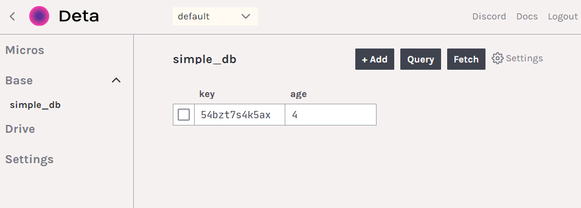
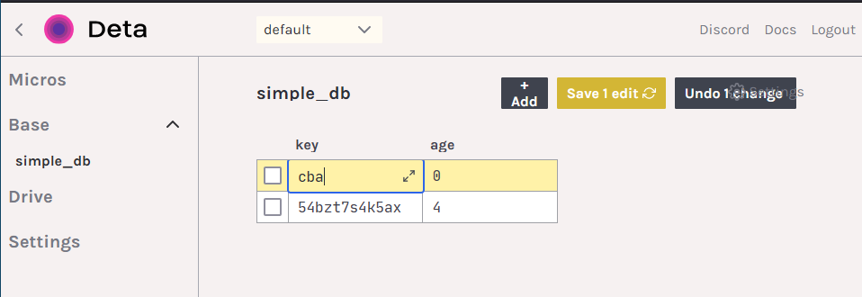
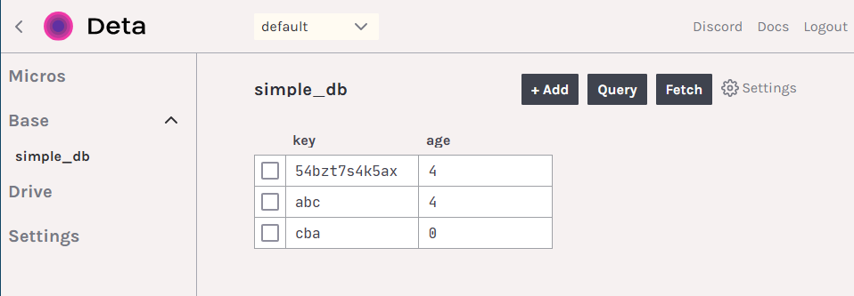

# ESP32/ESP8266: Working with Deta Base (Static)
This is part 1 of a 2 part tutorial on using Deta Base with an ESP32 running the Arduino core. This tutorial focuses on getting setup and performing CRUD operations on fixed data. The second tutorial focuses on dynamic and variable data.

This tutorial focuses on using an ESP32/ESP8266 to interface with a Deta Base instance. Deta Base is online NoSQL database, which is free to use and unlimited. These qualities make it perfect for experimental projects and hackathons. 

By the end of this tutorial, you will be able to perform CRUD(Create, Read, Update, Delete) and query operations in a Deta Base instance using an ESP32. 

If you already have a Deta Base instance set up with a Project name, Project Key(aka API key), and Base name in hand, skip the Deta Base setup section and proceed to the Arduino section. 

## Deta Base Setup
### Creating an Account 
Signing up for Deta is fairly straightforward. You have to choose your username and password, and enter a valid email address for a verification link.


A verification email will be sent your email address, and once you click the link and verify, you should be able to see your Deta dashboard. 

When you login for the first time, you may be asked to create a new project. Choose a name if asked, and then you be shown your Deta project id and project key. **These will only be shown once**, so make sure to copy them somewhere, since these will be used in our Arduino code.

### Some Theory
The way Base works is that it automatically creates a Base(database) instance when you try to put an object in a database that does not exist.   So we don't need to worry about creating a Base instance at this point. We can just choose the name we want and go with it. For the purpose of this tutorial, let's choose the name `simple_db`. 

At this point, you should have the following to proceed:
* Deta Project ID
* Deta Project Key(aka API Key)
* A Deta Base of your choice
* An ESP32 ready to go
* A WiFi connection
	* SSID and Password
	*  >**Note**: Enterprise connections do not work with the ESP32. If all you have is an enterprise WiFi connection, create a mobile hotspot using a PC or mobile device.

## Arduino Code
### Prerequisites
We will be installing a library called `  
detaBaseArduinoESP32`, which will abstract away all the complex networking aspects of interacting with an online database such as Deta Base.

To do so, go to [https://github.com/A223D/detaBaseArduinoESP32](https://github.com/A223D/detaBaseArduinoESP32) and click the green `Code` button and then `Download ZIP`. 


Save it to a location you remember, and then open the Arduino IDE. In the `Sketch` menu, and in the `Include Library` menu, click on the `Add .ZIP library...` option. 


Browse to the location where the .zip file was saved, select it, and then click the `Open` button. You should get a message saying that the library has been added.

 

### Verifying Everything Works
**Restart the Arduino IDE**. 
Change your board to ESP32 from the `Tools` menu and `Board` sub menu. Then open the `File` menu, and go to the `Examples` submenu. Scroll down till you see `detaBaseArduinoESP32`. 

> **Note**: If you don't see `detaBaseArduinoESP32`, check your board selection again. 

Select the example named `detaLibTest` and compile it. If everything compiles, that means you are ready to move on to programming!

 

### Programming
Let's start with a blank sketch. Save it to the location of your choice, and let's begin programming. 

Let's start by including the required libraries for our project. The following the snippet of code include the library we just installed and the `WiFiClientSecure` library as well. This also implicitly includes `WiFi` library which we will also use.
```c++
#include <detaBaseArduinoESP32.h>
#include <WiFiClientSecure.h>
```

Let's define some global variables. We will define our Deta project key, project name, and Base name, a `WiFiClientSecure` object, and a `DetaBaseObject` object, to which all the previous variables and objects are passed. The Base name can be an existing Base instance or something of our choice, in which the Base of that name will be created. The last boolean parameter is used to enable debugging statement. You can choose to leave this parameter out if you choose.

`client` is passed to the `DetaBaseObject` as is, without any modification. This is done because a root CA certificate is set in the `DetaBaseObject` constructor. This is required since we are making requests over HTTPS.
```c++
char* apiKey = "MY_KEY";
char* detaID = "MY_ID";
char* detaBaseName = "MY_BASE";

WiFiClientSecure client;
//choose this:
DetaBaseObject detaObj(client, detaID, detaBaseName, apiKey, true);
//or this:
//DetaBaseObject detaObj(client, detaID, detaBaseName, apiKey);
```

Let's move on to the setup code. We initialize the `Serial` library, and print some helpful messages to tell us where we are in the program. We then connect to a WiFi network. Replace `MY_SSID` and `MY_PASSWORD` with your actual SSID and password. 

```c++
void setup() {
  Serial.begin(115200);
  Serial.println("Initializing WiFi");
  WiFi.begin("MY_SSID", "MY_PASSWORD");
  Serial.println("Waiting to connect to WiFi");
  while (WiFi.status() != WL_CONNECTED) {
    delay(500);
    Serial.print(".");
  }
  Serial.println("WiFi connected!");
}
```
#### Before We Move On to the Loop
For the loop, we will put, get, delete, insert, update, and query for objects in Deta Base. These terms have specific meanings corresponding to different types of requests listed out in the [HTTP Base docs](https://docs.deta.sh/docs/base/http/). It is **highly recommended** to read through the mentioned documentation, as this library's functions correspond to the requests listed there, and expect input in the same format as the payloads.

There is a `result` structure built in to the library, which facilitates getting a response from Deta Base. It is defined as:
```c++
typedef struct {
	int statusCode;
	String reply;
} result;
```
Each function of the library that interacts with Deta Base returns a `result` struct containing the HTTP status code of the response in the `statusCode` int and JSON payload of the response in the `reply` String. [Here is a list of HTTP status codes](https://developer.mozilla.org/en-US/docs/Web/HTTP/Status). The gist is that if the `statusCode` of the returned `result` struct is in the 200s, your request was successfully completed, and the reply is in the `reply` String. If the `statusCode` is in the 400s, something went wrong, and some JSON containing error message will be present `reply` String. 

There is also a `printResult` method provided which makes it easier to print the status code of the response and the returned JSON reply. Hence, functions can be used in the following way:
```c++
printResult(detaObj.putObject("Something"));
```
#### The Loop
The first operation we perform will be to insert something into the database. We will use the `putObject` function for this purpose. As the [docs](https://docs.deta.sh/docs/base/http/#example) mention, the expected JSON input is in the following format:
```json
{
	"items":  [
		{
			"key":  {key}, //not necessary
			"field1":  "value1"
		}
	]
}
```
The key is optional, and will be assigned by Deta Base if not provided. If a key is provided, and an entry already exists with that key, it is overwritten. So if we write the following line of code
```c++
printResult(detaObj.putObject("{\"items\":[{\"age\":4}]}"));
```
, it will add
```json
{
	"age": 4
}
```
into the database. Then it will print the status code and reply so we know whether or not the request succeeded. The docs mention that the response payload will contain the key assigned to it. It also mentioned that multiple objects can be sent using one request/function call. 
>**Note**: A backslash character (`\`) is added before each `"` to indicate an escape character, since we require `"` in the JSON input.
>**Note**: **Keys have to be strings**. If you want to use a number as a key, make sure it is interpreted as a string by enclosing it in double-quotes. (Double quotes with back-slashes.

If the request succeeded, we will see a 200 level status code in the Serial monitor, as well as the entire object(s) with it's key(s).

If we login to Deta.sh and go the our project dashboard, we can even see our object added in the online GUI under Base->simple_db.


The next thing we will do is retrieve an object by its key using the `getObject()` function. The function expects an existing or non-existent key as its input. Let's try to retrieve an object with the key `abc` (even though we know no such objects exists yet).
```c++
printResult(detaObj.getObject("abc"));
```
If we run this code, we should see a status code of 404 and an error message in the response payload saying that the object was not found. This is expected as we know that no such object exists. Let's create an object with the key `abc` and try to retrieve it again. 

We can either use `putObject` to create an object with the key `cba` or we can use the online Base GUI to do so, by clicking the `Add` button, setting the fields manually, and then clicking `Save 1 edit`.



Now, if we execute 
```c++
printResult(detaObj.getObject("cba"));
```
, we will get a status code in the 200s, and the entire object with this key will be printed out.

Similarly, we can delete an object in the database by using the `deleteObject` function. This function also expects a key as it's input. This function always returns a 200 level status code whether or not an object with the specified key existed.
Here is an example:
```c++
printResult(detaObj.deleteObject("cba"));
```
The output indicates successful deletion, even though we know that no object with the key `cba` exists.  If there was an object with this key, it would have been deleted. This is by design, and there is no way to know if an object with the specified key existed or not.

The `insertObject` function corresponds to [this type of request in the docs](https://docs.deta.sh/docs/base/http/#insert-item). The expected input is in the following format:
```json
{
	"item":  {
		"key":  {key},  // optional
		// rest of item
	}
}
```
and the object is only inserted if no other object with the same key exists. If a key is not provided in the payload, it works just like the `putObject` function. Executing the following
```c++
printResult(detaObj.insertObject("{\"item\":{\"key\":\"cba\",\"age\":4}}"));
```
will add the object
```json
{
	"key": "cba",
	"age": 4
}
```
as long as no other entry with the key `cba` exists. Since we just created an object with the key `cba`, we will get a 400 level status code and some error in the payload. 
Executing
```c++
printResult(detaObj.insertObject("{\"item\":{\"key\":\"abc\",\"age\":4}}"));
```
will give us a 200 level status code (successful request) since no other entry with key `abc` existed before this one. You can see with the online GUI that this entry has been added. 

 

`updateObject` is used to update existing entries. It expects a key for an existing object and an input in the following JSON format:
```json
{

	"set"  :  {
		//set some attribute to some value like
		//age: 10
	},

	"increment"  :{
		//increment some attribute by some value like
		//age: 1
	},
	
	"append":  {
		//append some value to some list attribute like
		//names: ["John"]
	},
	
	"prepend": {
		//append some value to some list attribute like
		//names: ["Sam"]
	},
	
	"delete":  [//attributes to be deleted]
}
```
All of the JSON sub-objects (set, increment, append, prepend, and delete) are optional. A more complete example containing a before and after scenario for this function/request can be [found in the docs here](https://docs.deta.sh/docs/base/http/#example-2).

Executing
```c++
 printResult(detaObj.updateObject("{\"increment\":{\"age\":1}}", "abc"));
```
will increase the value of the `age` attribute by 1 in the entry of key `abc`. The status code and the reply will be printed accordingly.

It is also possible to execute queries on the entire database and retrieve entries that match the query. The queries are also in JSON with a specific format. The formatting of a JSON query for Deta Base is explained [here](https://docs.deta.sh/docs/base/queries/).
Executing
```c++
printResult(detaObj.query("{\"query\":[{\"age?lt\": 10}]}"));
```
will provide us with all the objects in the database which have the value of their `age` attribute less than 10. This should return all the objects in our database. 

## Conclusion
The final code for this tutorial is:
```c++
#include <detaBaseArduinoESP32.h>
#include <WiFiClientSecure.h>

char* apiKey = "MY_KEY";
char* detaID = "MY_ID";
char* detaBaseName = "MY_BASE";

WiFiClientSecure client;
//choose this:
DetaBaseObject detaObj(client, detaID, detaBaseName, apiKey, true);
//or this:
//DetaBaseObject detaObj(client, detaID, detaBaseName, apiKey);

void setup() {
  Serial.begin(115200);
  Serial.println("Initializing WiFi");
  WiFi.begin("MY_SSID", "MY_PASSWORD");
  Serial.println("Waiting to connect to WiFi");
  while (WiFi.status() != WL_CONNECTED) {
    delay(500);
    Serial.print(".");
  }
  Serial.println("WiFi connected!");
}

void loop(){
	printResult(detaObj.putObject("{\"items\":[{\"age\":4}]}"));
	Serial.println(); //for ease of reading

	printResult(detaObj.getObject("abc"));
	Serial.println(); //for ease of reading

	printResult(detaObj.deleteObject("cba"));
	Serial.println(); //for ease of reading

	printResult(detaObj.insertObject("{\"item\":{\"key\":\"cba\",\"age\":4}}"));
	Serial.println(); //for ease of reading

	printResult(detaObj.insertObject("{\"item\":{\"key\":\"abc\",\"age\":4}}"));
	Serial.println(); //for ease of reading

	printResult(detaObj.updateObject("{\"increment\":{\"age\":1}}", "abc"));
	Serial.println(); //for ease of reading

	printResult(detaObj.query("{\"query\":[{\"age?lt\": 10}]}"));
	Serial.println(); //for ease of reading
}
```
and it will do the respective operations on the database. Remember that the `printResult` function is not optional and each functional can be written as 
```c++
detaObj.putObject("{\"items\":[{\"age\":4}]}");
detaObj.getObject("abc");
//etc.
```
if the output is not required.

This tutorial dealt with sending fixed data to a Deta Base instance. To learn how to send dynamic data (such as a continuous read value from a sensor), [move on part 2](https://github.com/A223D/ESP32DetaGuides/tree/main/Part2). 

## Frequently Asked Questions
* Check payload error
	This error occurs when the JSON input being provided is invalid or is not in the correct format. Check whether each bracket is closed, and that each internal `"` has its own `\`.
* Nested JSON objects
Nested JSON objects can be accessed with a `.` operator. [Check the docs](https://docs.deta.sh/docs/base/http) to see how it's done.
