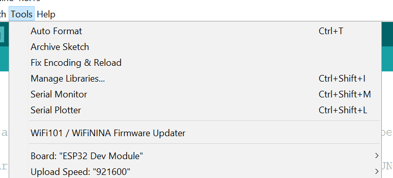
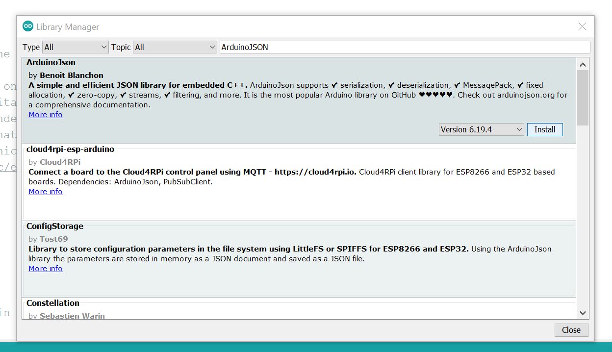

# ESP32/ESP8266: Working with Deta Base (Dynamic)
This is part 2 of a 2 part tutorial on using Deta Base with an ESP32 running the Arduino core. This tutorial focuses on sending and receiving dynamic data(such as continuous values from a sensor). The first tutorial focuses on getting set up and fixed data.

This tutorial focuses on using an ESP32/ESP8266 to interface with a Deta Base instance using the [`ArduinoJson`](https://arduinojson.org/) library to facilitate JSON serialization, deserialization, and processing. Deta Base is online NoSQL database, which is free to use and unlimited. These qualities make it perfect for experimental projects and hackathons.

By the end of this tutorial, you will be able to serialize(pack) JSON objects containing values read from a potentiometer, upload them to the database, retrieve values from the database, and deserialize(unpack) them.

This project assumes basic familiarity with Deta Base and using the [`detaBaseArduinoESP32`](https://github.com/A223D/detaBaseArduinoESP32) to send data to the Base instance.

## Deta Base Setup
This tutorial assumes that  a Deta project is set up with a Deta project ID, project key, and Base name in hand. If needed, the previous part goes over setting up a Deta Base instance. 

## ArduinoJson Setup
`ArduinoJson` is a library that makes it easy to work with JSON object in Arduino. This library is available for free in the Arduino Library Manager, and is required for this tutorial. To install this library, open the Arduino IDE and under the `Tools` menu, click on `Manage Libraries`.
 
Search for `ArduinoJSON` and click install.
 

## Arduino Code
### Declarations
We include the libraries from the previous tutorial, along with `ArduinoJson`.
```c++
#include <ArduinoJson.h>
#include <detaBaseArduinoESP32.h>
#include <WiFiClientSecure.h>
```
We define our Deta project ID, project key(API key), and base name, in the same way we did last time. We then declare a `WiFiClientSecure` object called `client`, and then pass `client` to the constructor of a `DetaBaseObject` object.
After that, we create a `StaticJsonDocument` of size 50 called `outer`. This will hold the JSON object that we will be sending to the online Base instance. The size 50 is a guesstimate, and should be adjusted based on how large your object could possibly be. From the [ArduinoJson Docs](https://arduinojson.org/v6/api/jsondocument/#staticjsondocument-vs-dynamicjsondocument), we can choose either [`DynamicJsonDocument`](https://arduinojson.org/v6/api/dynamicjsondocument/) or [`StaticJsonDocument`](https://arduinojson.org/v6/api/staticjsondocument/) depending on the size of our JSON object. I have decided to go with `StaticJsonDocument`.
```c++
char* apiKey = "MY_KEY";
char* detaID = "MY_ID";
char* detaBaseName = "MY_BASE";

WiFiClientSecure client;
DetaBaseObject detaObj(client, detaID, detaBaseName, apiKey, true);
StaticJsonDocument<50> outer;
``` 
We also declare a `String` called `jsonString` to hold our serialized JSON object once it is created. An `int` called `val` is also defined to hold a demo value which is loaded into our JSON object. This demo value is read back from the response, updated, and then sent back to the server.
```c++
String jsonString;
int val = 1;
```
### Setup Code
Here is our setup function:
```c++
void setup() {
  Serial.begin(115200);
  StaticJsonDocument<20> internal;
  Serial.println("Let's begin initialization");
  JsonArray items = outer.createNestedArray("items");
  internal["age"] = val;
  items.add(internal);
  serializeJson(outer, jsonString);
  Serial.println(jsonString);
  WiFi.begin("MY_SSID", "MY_PASSWORD");
  Serial.println("Waiting to connect to WiFi");
  while (WiFi.status() != WL_CONNECTED) {
    delay(500);
    Serial.print(".");
  }
  Serial.println();
  jsonString = "";
}
```
`putObject` expects a JSON object in the following format:
```json
{
	"items":  [
		{
			"key":  {key}, //not necessary
			"field1":  "value1"
		}
	]
}
```
In our setup function, we initialize the Serial library to print some helpful statements during program execution. We also create another `StaticJsonDocument` called `internal` to hold our internal JSON object. In the next line, we create a JSON array(called `items`, and given the name "items") to hold the JSON objects(`internal`, in this case). We then create an attribute called `age` in the `internal` JSON object, and assign the value `val` to it. The `internal` object is then added to the `items` array in the `outer` object.

The `serializeJson` function serializes(packs) the complete JSON object into a String. The format for this function is 
```c++
serializeJson(JsonDocument, outputString);
```
and the serialized JSON object is appended to the output String. Consequently, we need to clear our output String(`jsonString`) each time we want to serialize a new JSON object into it. 
We then print `jsonString` to make sure everything is looking okay, and then connect to WiFi. Replace `MY_SSID` and `MY_PASSWORD` with your actual SSID and password. 
> **Note**: Enterprise connections do not work with the ESP32. If all you have is an enterprise WiFi connection, create a mobile hotspot using a PC or mobile device.

Once WiFi is connected, we clear `jsonString`. As mentioned previously `jsonString` must be cleared each time since `serializeJSON` appends, instead of overwrites. 

### Loop Code
```c++
void loop() {
  StaticJsonDocument<120> receiving;
  outer["items"][0]["age"] = val * 2;
  serializeJson(outer, jsonString);
  Serial.println(jsonString);

  result myResult = detaObj.putObject(jsonString.c_str());
  Serial.println();
  Serial.println(myResult.statusCode);
  Serial.println(myResult.reply);
  deserializeJson(receiving, myResult.reply);
  const char* assignedKey = receiving["processed"]["items"][0]["key"];
  val = receiving["processed"]["items"][0]["age"];

  Serial.print("Key assigned by Deta:\t");
  Serial.println(assignedKey);
  Serial.print("Value received:\t");
  Serial.println(val);

  jsonString = "";
  delay(10000);
}
```
A `StaticJsonDocument` to hold our response JSON payload is declared, which is used later on. `val` is multiplied by 2 to uniquely update it for each iteration of the loop. We then serialize it to `jsonString`, and print it out for debugging purposes. 
We then use `putObject`, and pass it the the c-string of `jsonString` by calling the `c_str()` function on `jsonString`. [More information on the `c_str()` function is available here](https://www.arduino.cc/reference/en/language/variables/data-types/string/functions/c_str/).
The returned `result` struct is stored in `myResult`. We then print the `statusCode` and `reply` from `myResult` to check for any errors. 
To recover our data back from the response JSON payload, we use `deserializeJson` to deserialize(unpack) the response JSON payload(`myResult.reply`) in a minified String format to actual JSON(`receiving`), holding c-style variables that we can read and use. [Check the ArduinoJson docs to see which types of variables are available](https://arduinojson.org/book/deserialization_tutorial6.pdf#page=12).
Once our response is deserialized, it will be in the following format, according to the [Deta Base HTTP Docs(Response tab of PUT Items)](https://docs.deta.sh/docs/base/http#put-items):
```json
{
    "processed": {
        "items": [
            // items which were stored 
        ]
    },
    "failed": {
       "items": [
           // items failed because of internal processing
       ]
    }
}
```
We declare a `const char*` called `assignedKey` to hold the key that the Deta Base instance automatically assigned. It is assigned to `receiving["processed"]["items"][0]["key"]`, which is where the new key is located. 
`val` is updated with the value of `age` in the response JSON payload. Doing this does not have any practical effect, as `val` is assigned the same value it was, but it is shown how to retrievean `int` from our response payload. According to the `myResult.reply` that was printed out, the value is located at `receiving["processed"]["items"][0]["age"]`, and that is assigned to `val` for the next iteration.

We then print out `assignedKey` and `val` to show that we have successfully retrieved them in c-type variables, and that they can be used for further processing.

`jsonString` is then reset for the next iteration of the loop, and `val` is increased by 1. A `delay()` is added for ease of readability but is not required. 

## Conclusion
The full code is:
```c++
#include <ArduinoJson.h>
#include <detaBaseArduinoESP32.h>
#include <WiFiClientSecure.h>

char* apiKey = "MY_KEY";
char* detaID = "MY_ID";
char* detaBaseName = "MY_BASE";

WiFiClientSecure client;
DetaBaseObject detaObj(client, detaID, detaBaseName, apiKey, true);
StaticJsonDocument<50> outer;

void setup() {
  Serial.begin(115200);
  StaticJsonDocument<20> internal;
  Serial.println("Let's begin initialization");
  JsonArray items = outer.createNestedArray("items");
  internal["age"] = val;
  items.add(internal);
  serializeJson(outer, jsonString);
  Serial.println(jsonString);
  WiFi.begin("MY_SSID", "MY_PASSWORD");
  Serial.println("Waiting to connect to WiFi");
  while (WiFi.status() != WL_CONNECTED) {
    delay(500);
    Serial.print(".");
  }
  Serial.println();
  jsonString = "";
}

void loop() {
  StaticJsonDocument<120> receiving;
  outer["items"][0]["age"] = val * 2;
  serializeJson(outer, jsonString);
  Serial.println(jsonString);

  result myResult = detaObj.putObject(jsonString.c_str());
  Serial.println();
  Serial.println(myResult.statusCode);
  Serial.println(myResult.reply);
  deserializeJson(receiving, myResult.reply);
  const char* assignedKey = receiving["processed"]["items"][0]["key"];
  val = receiving["processed"]["items"][0]["age"];

  Serial.print("Key assigned by Deta:\t");
  Serial.println(assignedKey);
  Serial.print("Value received:\t");
  Serial.println(val);

  jsonString = "";
  delay(10000);
}

```

## Frequently Asked Questions
* Missing or incorrect deserialized values
	Try increasing the size of the receiving `StaticJsonDocument` or `DynamicJsonDocument`. It is a guesstimate, and it generally needs adjusting to find it's minimum value. Try a high value, and then gradually lessening it.
