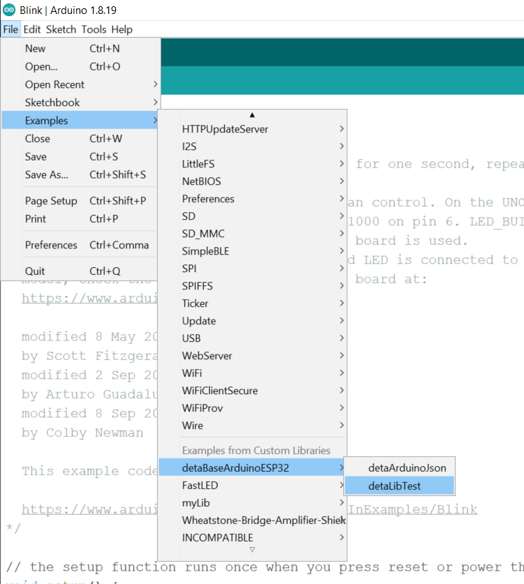

# ESP32/ESP8266: Working with Deta Base

This tutorial focuses on using an ESP32/ESP8266 to interface with a Deta Base instance. Deta Base is online NoSQL database, which is free to use and unlimited. These qualities make it perfect for experimental projects and hackathons. 

By the end of this tutorial, you will be able to able to perform CRUD(Create, Read, Update, Delete) and query operations in a Deta Base instance using an ESP32. 
# ESP32/ESP8266: Working with Deta Base (Basic)
This is part 1 of a 2 part tutorial on using Deta Base with an ESP32 running the Arduino core. This tutorial focuses on getting setup and performing CRUD operations on fixed data. The second tutorial focuses on dynamic and variable data.

This tutorial focuses on using an ESP32/ESP8266 to interface with a Deta Base instance. Deta Base is online NoSQL database, which is free to use and unlimited. These qualities make it perfect for experimental projects and hackathons. 

By the end of this tutorial, you will be able to able to perform CRUD(Create, Read, Update, Delete) and query operations in a Deta Base instance using an ESP32. 

If you already have a Deta Base instance set up with a Project name, Project Key(aka API key), and Base name in hand, skip the Deta Base setup section and proceed to the Arduino section. 

## Deta Base Setup
### Creating an Account 
Signing up for Deta is fairly straightforward. You have to choose your username and password, and enter a valid email address for a verification link.


A verification email will be sent your email address, and once you click the link and verify, you should be able to see your Deta dashboard. 

When you login for the first time, you may be asked to create a new project. Choose a name if asked, and then you be shown your Deta project id and project key. **These will only be shown once**, so make sure to copy them somewhere, since these will be used in our Arduino code.

### Some Theory
The way Base works is that it automatically creates a Base(database) instance when you try to put an object in a database that does not exist.   So we don't need to worry about creating a Base instance at this point. We can just choose the name we want and go with it. For the purpose of this tutorial, let's choose the name `simple_db`. 

At this point, you should have the following to proceed:
* Deta Project ID
* Deta Project Key(aka API Key)
* A Deta Base of your choice
* An ESP32 ready to go
* A WiFi connection
	* SSID and Password
	*  >**Note**: Enterprise connections do not work with the ESP32. If all you have is an enterprise WiFi connection, create a mobile hotspot using a PC or mobile device.

## Arduino Code
### Prerequisites
We will be installing a library called `  
detaBaseArduinoESP32`, which will abstract away all the complex networking aspects of interacting with an online database such as Deta Base.

To do so, go to [https://github.com/A223D/detaBaseArduinoESP32](https://github.com/A223D/detaBaseArduinoESP32) and click the green `Code` button and then `Download ZIP`. 


Save it to a location you remember, and then open the Arduino IDE. In the `Sketch` menu, and in the `Include Library` menu, click on the `Add .ZIP library...` option. 


Browse to the location where the .zip file was saved, select it, and then click the `Open` button. You should get a message saying that the library has been added.

 

### Verifying Everything Works
**Restart the Arduino IDE**. 
Change your board to ESP32 from the `Tools` menu and `Board` sub menu. Then open the `File` menu, and go to the `Examples` submenu. Scroll down till you see `detaBaseArduinoESP32`. 

> **Note**: If you don't see `detaBaseArduinoESP32`, check your board selection again. 

Select the example named `detaLibTest` and compile it. If everything compiles, that means you are ready to move on to programming!

 

### Programming
Let's start with a blank sketch. Save it to the location of your choice, and let's begin programming. 

Let's start by including the required libraries for our project. The following the snippet of code include the library we just installed and the `WiFiClientSecure` library as well. This also implicitly includes `WiFi` library which we will also use.
```c++
#include <detaBaseArduinoESP32.h>
#include <WiFiClientSecure.h>
```

Let's define some global variables. We will define our Deta project key, project name, and Base name, a `WiFiClientSecure` object, and a `DetaBaseObject` object, to which all the previous variables and objects are passed. The Base name can be an existing Base instance or something of our choice, in which the Base of that name will be created. The last boolean parameter is used to enable debugging statement. You can choose to leave this parameter out if you choose.

`client` is passed to the `DetaBaseObject` as is, without any modification. This is done because a root CA certificate is set in the `DetaBaseObject` constructor. This is required since we are making requests over HTTPS.
```c++
char* apiKey = "MY_KEY";
char* detaID = "MY_ID";
char* detaBaseName = "MY_BASE";

WiFiClientSecure client;
//choose this:
DetaBaseObject detaObj(client, detaID, detaBaseName, apiKey, true);
//or this:
//DetaBaseObject detaObj(client, detaID, detaBaseName, apiKey);
```

Let's move on to the setup code. We initialize the `Serial` library, and print some helpful messages to tell us where we are in the program. We then connect to a WiFi network. Replace `MY_SSID` and `MY_PASSWORD` with your actual SSID and password. 

```c++
void setup() {
  Serial.begin(115200);
  Serial.println("Initializing WiFi");
  WiFi.begin("MY_SSID", "MY_PASSWORD");
  Serial.println("Waiting to connect to WiFi");
  while (WiFi.status() != WL_CONNECTED) {
    delay(500);
    Serial.print(".");
  }
  Serial.println("WiFi connected!");
}
```
#### Before We Move On to the Loop
For the loop, we will put, get, delete, insert, update, and query for objects in Deta Base. These terms have specific meanings corresponding to different types of requests listed out in the [HTTP Base docs](https://docs.deta.sh/docs/base/http/). It is **highly recommended** to read through the mentioned documentation, as this library's functions correspond to the requests listed there, and expect input in the same format as the payloads.

There is a `result` structure built in to the library, which facilitates getting a response from Deta Base. It is defined as:
```c++
typedef struct {
	int statusCode;
	String reply;
} result;
```
Each function of the library that interacts with Deta Base returns a `result` struct containing the HTTP status code of the response in the `statusCode` int and HTML payload of the response in the `reply` String. [Here is a status of HTTP status codes](https://developer.mozilla.org/en-US/docs/Web/HTTP/Status). The gist is that if the `statusCode` of the returned `result` struct is in the 200s, your request was successfully completed, and the reply is in the `reply` String. If the `statusCode` is in the 400s, something went wrong, and some HTML containing error message will be present `reply` String. 

There is also a `printResult` method provided which makes it easier to print the status code of the response and the returned HTML reply. Hence, functions can be used in the following way:
```c++
printResult(detaObj.putObject("Something"));
```
#### The Loop
The first operation we perform will be to insert something into the database. We will use the `putObject` function for this purpose. As the [docs](https://docs.deta.sh/docs/base/http/#example) mention, the expected JSON input is in the following format:
```json
{
	"items":  [
		{
			"key":  {key}, //not necessary
			"field1":  "value1"
		}
	]
}
```
The key is optional, and will be assigned by Deta Base if not provided. If a key is provided, and an entry already exists with that key, it is overwritten. So if we write the following line of code
```c++
printResult(detaObj.putObject("{\"items\":[{\"age\":4}]}"));
```
, it will add an entry with `age` as 4 in the database. Then it will print the status code and reply so we know whether or not the request succeeded. The docs mention that the response payload will contain the key assigned to it.
>**Note**: A backslash character (`/`) is added before each `"` to indicate an escape character, since we require `"` in the JSON input.