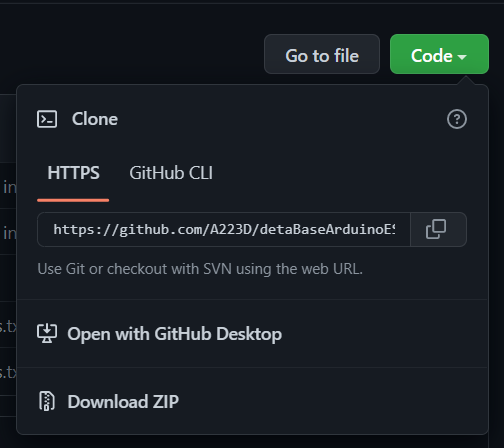
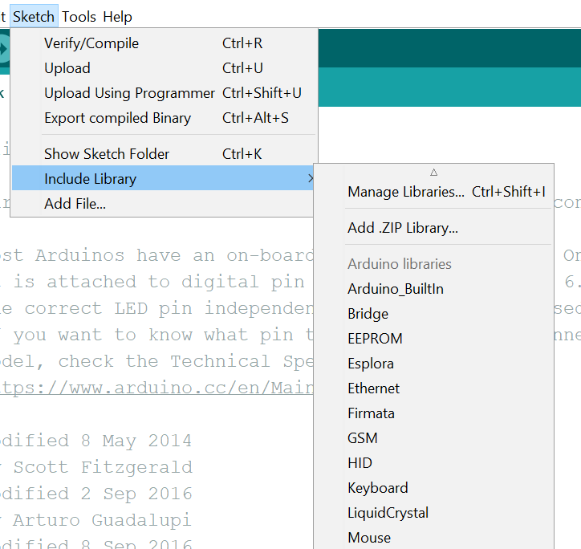

# ESP32/ESP8266: Working with Deta Base

This tutorial focuses on using an ESP32/ESP8266 to interface with a Deta Base instance. Deta Base is online NoSQL database, which is free to use and unlimited. These qualities make it perfect for experimental projects and hackathons. 

By the end of this tutorial, you will be able to able to perform CRUD(Create, Read, Update, Delete) and query operations in a Deta Base instance using an ESP32. 

If you already have a Deta Base instance set up with a Project name, Project Key(aka API key), and Base name in hand, skip the Deta Base setup section and proceed to the Arduino section. 

## Deta Base Setup
### Creating an Account 
Signing up for Deta is fairly straightforward. You have to choose your username and password, and enter a valid email address for a verification link.

A verification email will be sent your email address, and once you click the link and verify, you should be able to see your Deta dashboard. 

When you login for the first time, you may be asked to create a new project. Choose a name if asked, and then you be shown your Deta project id and project key. **These will only be shown once**, so make sure to copy them somewhere, since these will be used in our Arduino code.

### Some Theory
The way Base works is that it automatically creates a Base(database) instance when you try to put an object in a database that does not exist.   So we don't need to worry about creating a Base instance at this point. We can just choose the name we want and go with it. For the purpose of this tutorial, let's choose the name `simple_db`. 

At this point, you should have the following to proceed:
* Deta Project ID
* Deta Project Key(aka API Key)
* A Deta Base of your choice
* An ESP32 ready to go
* A WiFi connection
	* SSID and Password
	*  >**Note**: Enterprise connections do not work with the ESP32. If all you have is an enterprise WiFi connection, create a mobile hotspot using a PC or mobile device.

## Arduino Code
### Prerequisites
We will be installing a library called `  
detaBaseArduinoESP32`, which will abstract away all the complex networking aspects of interacting with an online database such as Deta Base.

To do so, go to [https://github.com/A223D/detaBaseArduinoESP32](https://github.com/A223D/detaBaseArduinoESP32) and click the green `Code` button and then `Download ZIP`. 

Save it to a location you remember, and then open the Arduino IDE. In the `Sketch` menu, and in the `Include Library` menu, click on the `Add .ZIP library...` option. 

Browse to the location where the .zip file was saved, select it, and then click the `Open` button. You should get a message saying that the library has been added.

 

### 